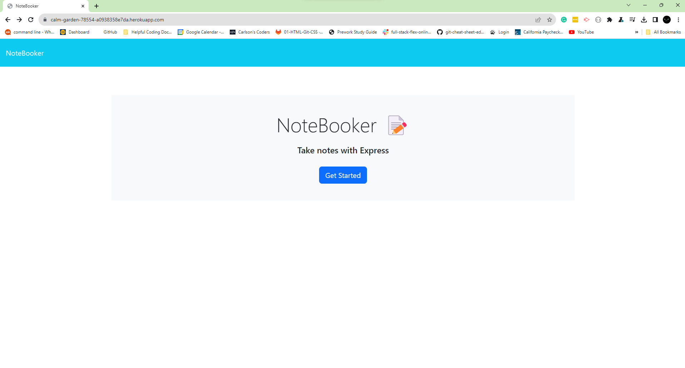
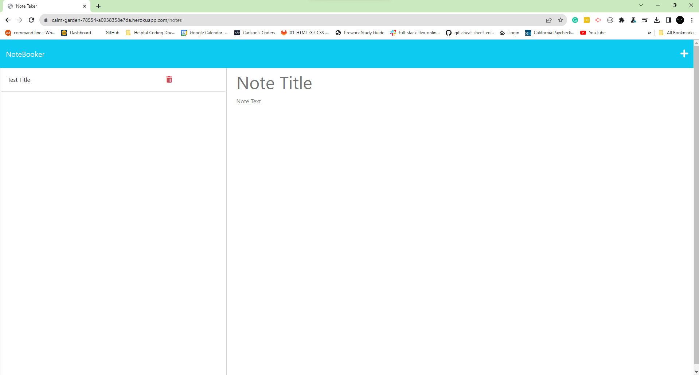

# NoteBooker

## Description

My motivation for making this project was to make an application to track my tasks and notes.
I find myself writing things down constantly throughout the day so I don't forget.
Now that I built this application, I'll have a better way to lead an efficient and organized life!

## Table of Contents (Optional)

- [Installation](#installation)
- [Usage](#usage)
- [Credits](#credits)
- [License](#license)

## Installation

1. Click on the URL to the application: [NoteBooker](https://calm-garden-78554-a0938358e7da.herokuapp.com)

## Usage

## Credits

[Professional README Guide](https://coding-boot-camp.github.io/full-stack/github/professional-readme-guide)

## License

---
